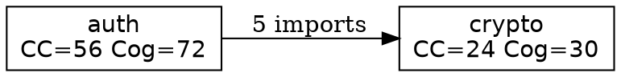
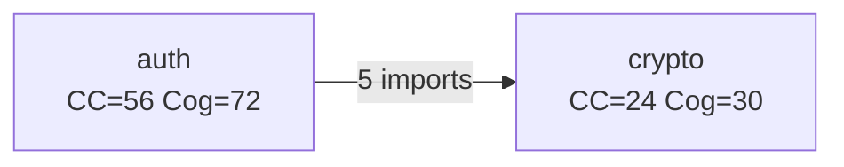

# APS-V1-0001 — Code Topology and Coupling Analysis

**Version**: 0.1.0
**Status**: Active
**Category**: Technical


## Terminology

The key words "MUST", "MUST NOT", "REQUIRED", "SHALL", "SHALL NOT", "SHOULD", "SHOULD NOT", "RECOMMENDED", "MAY", and "OPTIONAL" in this document are to be interpreted as described in [RFC 2119](https://datatracker.ietf.org/doc/html/rfc2119).

---

## 1. Scope and Authority

### 1.1 Purpose

This standard defines a **language-agnostic artifact format** for capturing code topology, complexity metrics, and coupling analysis across polyglot codebases. The artifacts are designed to be:

1. **Committable** — Stored in version control alongside code
2. **Deterministic** — Same codebase → same artifacts
3. **Machine-readable** — Consumable by AI agents and tooling
4. **Human-reviewable** — Diffable and inspectable

### 1.2 Scope

This standard covers:

- **Artifact format specification** — Directory structure and file schemas
- **Metrics definitions** — Cyclomatic, Cognitive, Halstead, and Martin's coupling metrics
- **Graph structures** — Call graphs, dependency graphs, coupling matrices
- **Language adapter interface** — How analyzers extract data from source code
- **Projector interface** — How visualizations consume artifacts

This standard does NOT cover:

- Specific visualization implementations (delegated to substandards)
- CLI interface details (informative only)
- Language-specific parsing internals

### 1.3 Relationship to Substandards

This standard defines the **data format**. Visualization implementations are defined as **substandards**:

| Substandard | Purpose |
|-------------|---------|
| `APS-V1-0001.FD01` | 3D Force-Directed Coupling Visualization |
| `APS-V1-0001.GV01` | Graphviz/DOT Projector |
| `APS-V1-0001.MM01` | Mermaid Diagram Projector |

Substandards MUST consume artifacts conforming to this specification.

### 1.4 Normative References

- [McCabe, T.J. (1976). "A Complexity Measure"](https://ieeexplore.ieee.org/document/1702388) — Cyclomatic Complexity
- [SonarSource Cognitive Complexity](https://www.sonarsource.com/docs/CognitiveComplexity.pdf) — Cognitive Complexity
- [Halstead, M.H. (1977). "Elements of Software Science"](https://en.wikipedia.org/wiki/Halstead_complexity_measures) — Halstead Metrics
- [Martin, R.C. (2003). "Agile Software Development"](https://en.wikipedia.org/wiki/Software_package_metrics) — Coupling Metrics

---

## 2. Core Definitions

### 2.1 Topology

A **topology** is a structured representation of a codebase's architecture, including:

- **Nodes**: Functions, files, modules, or packages
- **Edges**: Relationships (calls, imports, dependencies)
- **Metrics**: Quantitative measurements attached to nodes

### 2.2 Artifact

An **artifact** is the persisted, committable output of topology analysis. Artifacts are stored in a `.topology/` directory at the repository root (or configurable location).

### 2.3 Granularity Levels

Analysis operates at three granularity levels:

| Level | Description | Example Node |
|-------|-------------|--------------|
| **Function** | Individual functions/methods | `auth::validate_token()` |
| **File** | Source files | `src/auth/validator.rs` |
| **Module** | Logical groupings (packages, namespaces) | `auth` |

### 2.4 Coupling

**Coupling** measures the degree of interdependence between modules. High coupling indicates tight integration; low coupling indicates loose integration.

### 2.5 Projector

A **projector** is a visualization component that reads topology artifacts and renders them in a specific format (2D graph, 3D model, diagram, etc.).

---

## 3. Artifact Format Specification

> **📋 Schema Source of Truth**: The canonical schemas for all artifacts are defined in the `proto/` directory using Protocol Buffers (proto3). The examples below are illustrative; see `proto/*.proto` for normative definitions. See ADR-0005 for rationale.

### 3.1 Directory Structure

Topology artifacts MUST be stored in a `.topology/` directory with the following structure:

```
.topology/
├── manifest.toml              # REQUIRED: Metadata and configuration
├── metrics/                   # REQUIRED: Complexity metrics
│   ├── functions.json         # Per-function metrics
│   ├── files.json             # Per-file aggregates
│   └── modules.json           # Per-module aggregates (with Martin's metrics)
├── graphs/                    # REQUIRED: Structural relationships
│   ├── call-graph.json        # Function call relationships
│   ├── dependency-graph.json  # Module/file dependencies
│   └── coupling-matrix.json   # Module coupling coefficients
├── snapshots/                 # OPTIONAL: Historical snapshots
│   └── YYYY-MM-DD.json        # Dated full snapshot
└── diffs/                     # OPTIONAL: Comparison artifacts
    └── <name>.json            # Diff between two snapshots
```

### 3.2 Manifest Schema (`manifest.toml`)

The manifest file MUST contain metadata about the analysis:

```toml
# .topology/manifest.toml

[topology]
version = "0.1.0"                    # REQUIRED: Schema version
generated_at = "2025-12-15T10:30:00Z" # REQUIRED: ISO 8601 timestamp
generator = "topology-cli"           # REQUIRED: Tool that generated artifacts
generator_version = "1.0.0"          # REQUIRED: Generator version

[analysis]
root = "."                           # REQUIRED: Relative path to analyzed root
languages = ["rust", "typescript"]   # REQUIRED: Languages detected/analyzed
total_files = 42                     # REQUIRED: Number of files analyzed
total_functions = 256                # REQUIRED: Number of functions analyzed
total_modules = 8                    # REQUIRED: Number of modules

[config]
granularity = ["function", "file", "module"]  # Levels computed
include_patterns = ["src/**", "lib/**"]       # Glob patterns included
exclude_patterns = ["**/test/**", "**/*.test.*"]  # Glob patterns excluded

[strategy]
mode = "full"                        # "full" or "incremental"
compress = false                     # Whether large files are gzipped
snapshot_retention = 10              # Number of historical snapshots to keep
```

### 3.3 Metrics Schemas

#### 3.3.1 Function Metrics (`metrics/functions.json`)

```json
{
  "schema_version": "0.1.0",
  "functions": [
    {
      "id": "rust:auth::validator::validate_token",
      "name": "validate_token",
      "file": "src/auth/validator.rs",
      "module": "auth",
      "language": "rust",
      "location": {
        "start_line": 42,
        "end_line": 78
      },
      "metrics": {
        "cyclomatic_complexity": 8,
        "cognitive_complexity": 12,
        "halstead": {
          "vocabulary": 45,
          "length": 120,
          "volume": 658.2,
          "difficulty": 15.3,
          "effort": 10070.5,
          "time_to_implement": 559.5,
          "estimated_bugs": 0.22
        },
        "lines_of_code": 36,
        "logical_lines": 28,
        "comment_lines": 8,
        "parameter_count": 3
      }
    }
  ]
}
```

#### 3.3.2 File Metrics (`metrics/files.json`)

```json
{
  "schema_version": "0.1.0",
  "files": [
    {
      "id": "src/auth/validator.rs",
      "path": "src/auth/validator.rs",
      "module": "auth",
      "language": "rust",
      "metrics": {
        "function_count": 5,
        "total_cyclomatic": 24,
        "avg_cyclomatic": 4.8,
        "max_cyclomatic": 8,
        "total_cognitive": 32,
        "avg_cognitive": 6.4,
        "max_cognitive": 12,
        "lines_of_code": 180,
        "comment_lines": 45,
        "maintainability_index": 72.5
      }
    }
  ]
}
```

#### 3.3.3 Module Metrics (`metrics/modules.json`)

Includes Martin's coupling metrics:

```json
{
  "schema_version": "0.1.0",
  "modules": [
    {
      "id": "auth",
      "name": "auth",
      "path": "src/auth/",
      "languages": ["rust"],
      "metrics": {
        "file_count": 4,
        "function_count": 18,
        "total_cyclomatic": 56,
        "avg_cyclomatic": 3.1,
        "total_cognitive": 72,
        "avg_cognitive": 4.0,
        "lines_of_code": 620,
        "martin": {
          "ca": 3,
          "ce": 5,
          "instability": 0.625,
          "abstractness": 0.2,
          "distance_from_main_sequence": 0.175
        }
      }
    }
  ]
}
```

**Martin's Metrics Definitions:**

| Metric | Name | Formula | Interpretation |
|--------|------|---------|----------------|
| **Ca** | Afferent Coupling | Count of modules that depend on this module | "Who depends on me?" |
| **Ce** | Efferent Coupling | Count of modules this module depends on | "Who do I depend on?" |
| **I** | Instability | Ce / (Ca + Ce) | 0 = stable, 1 = unstable |
| **A** | Abstractness | Abstract types / Total types | 0 = concrete, 1 = abstract |
| **D** | Distance | \|A + I - 1\| | Distance from ideal "main sequence" |

### 3.4 Graph Schemas

#### 3.4.1 Call Graph (`graphs/call-graph.json`)

```json
{
  "schema_version": "0.1.0",
  "nodes": [
    {
      "id": "rust:auth::validator::validate_token",
      "type": "function",
      "module": "auth",
      "language": "rust"
    }
  ],
  "edges": [
    {
      "from": "rust:auth::validator::validate_token",
      "to": "rust:crypto::hmac::verify",
      "type": "calls",
      "count": 1
    }
  ]
}
```

#### 3.4.2 Dependency Graph (`graphs/dependency-graph.json`)

```json
{
  "schema_version": "0.1.0",
  "level": "module",
  "nodes": [
    {
      "id": "auth",
      "type": "module",
      "languages": ["rust"]
    },
    {
      "id": "crypto",
      "type": "module",
      "languages": ["rust"]
    }
  ],
  "edges": [
    {
      "from": "auth",
      "to": "crypto",
      "type": "imports",
      "weight": 5
    }
  ]
}
```

#### 3.4.3 Coupling Matrix (`graphs/coupling-matrix.json`)

The coupling matrix is the primary input for 3D visualization. **Schema version 2.0** includes component breakdown:

```json
{
  "schema_version": "2.0.0",
  "metric": "composite_coupling",
  "description": "Composite coupling strength combining structural metrics (0-1)",
  "modules": ["auth", "api", "db", "utils", "crypto"],
  "matrix": [
    [1.00, 0.73, 0.22, 0.41, 0.82],
    [0.68, 1.00, 0.61, 0.35, 0.28],
    [0.18, 0.59, 1.00, 0.17, 0.12],
    [0.38, 0.31, 0.14, 1.00, 0.23],
    [0.79, 0.24, 0.09, 0.19, 1.00]
  ],
  "components": {
    "import_coupling": {
      "weight": 0.30,
      "description": "Weighted import statement dependencies",
      "matrix": [[1.0, 0.8, 0.1, 0.3, 0.9], ...]
    },
    "call_coupling": {
      "weight": 0.25,
      "description": "Cross-module function invocations",
      "matrix": [[1.0, 0.7, 0.3, 0.5, 0.8], ...]
    },
    "symbol_coupling": {
      "weight": 0.20,
      "description": "Distinct symbols used from other modules",
      "matrix": [[1.0, 0.6, 0.2, 0.4, 0.7], ...]
    },
    "type_coupling": {
      "weight": 0.15,
      "description": "Type references (struct, enum, trait)",
      "matrix": [[1.0, 0.9, 0.4, 0.6, 0.8], ...]
    },
    "change_coupling": {
      "weight": 0.10,
      "description": "Co-change frequency from git history",
      "source": "git",
      "matrix": [[1.0, 0.5, 0.1, 0.2, 0.6], ...]
    }
  },
  "layout": {
    "algorithm": "force-directed",
    "seed": 42,
    "positions": {
      "auth": [1.2, 3.4, 0.5],
      "api": [1.5, 3.2, 0.8],
      "db": [-2.1, 1.0, -0.3],
      "utils": [0.0, -1.5, 2.0],
      "crypto": [1.8, 3.8, 0.2]
    }
  },
  "metadata": {
    "normalization": "logarithmic_percentile",
    "directional": true,
    "generated_at": "2025-12-17T10:30:00Z"
  }
}
```

**Backward Compatibility:**

Schema version 1.0 files (without `components`) are still valid. Implementations SHOULD support both versions. When reading v1.0, assume the single matrix is `import_coupling` with weight 1.0.

**Matrix Interpretation:**

- `matrix[i][j]` = coupling from module `modules[i]` TO module `modules[j]`
- Directional: A depending on B ≠ B depending on A
- Visualizations MAY use `max(matrix[i][j], matrix[j][i])` for edge rendering

### 3.5 Snapshot Schema (`snapshots/YYYY-MM-DD.json`)

Historical snapshots enable trend analysis:

```json
{
  "schema_version": "0.1.0",
  "timestamp": "2025-12-15T10:30:00Z",
  "commit_hash": "abc123def456",
  "summary": {
    "total_files": 42,
    "total_functions": 256,
    "total_cyclomatic": 512,
    "avg_cyclomatic": 2.0,
    "total_cognitive": 640,
    "avg_cognitive": 2.5,
    "coupling_density": 0.35
  },
  "hotspots": [
    {
      "id": "rust:api::handlers::process_request",
      "cyclomatic": 25,
      "cognitive": 32
    }
  ]
}
```

### 3.6 Diff Schema (`diffs/<name>.json`)

Diff artifacts compare two topology snapshots for CI integration. The diff schema provides a standardized format for detecting regressions and generating PR comments.

**Storage:** `.topology/diffs/<name>.json` or stdout from `aps run topology diff`

```json
{
  "schema_version": "1.0.0",
  "status": "warning",
  "timestamp": "2025-12-17T12:00:00Z",
  "base": {
    "git_ref": "main",
    "commit": "abc1234",
    "path": ".topology-base/"
  },
  "target": {
    "git_ref": "feat/new-feature",
    "commit": "def5678",
    "path": ".topology-pr/"
  },
  "summary": {
    "functions_added": 3,
    "functions_removed": 1,
    "functions_modified": 5,
    "modules_added": 0,
    "modules_removed": 0,
    "modules_modified": 2
  },
  "metrics": {
    "total_cyclomatic": { "base": 142, "target": 156, "delta": 14, "percent_change": 9.86 },
    "avg_cyclomatic": { "base": 4.2, "target": 4.8, "delta": 0.6, "percent_change": 14.29 },
    "total_cognitive": { "base": 98, "target": 112, "delta": 14, "percent_change": 14.29 },
    "coupling_density": { "base": 0.42, "target": 0.44, "delta": 0.02, "percent_change": 4.76 }
  },
  "hotspots": [
    {
      "id": "rust:auth::validator::validate_token",
      "type": "INCREASED_COMPLEXITY",
      "reason": "Cyclomatic complexity increased from 8 to 12 (+50%)",
      "severity": 2,
      "suggestion": "Consider extracting validation sub-functions"
    }
  ],
  "violations": [
    {
      "threshold": "avg_cognitive_delta",
      "value": 0.5,
      "limit": 0.3,
      "severity": "WARNING",
      "message": "Average cognitive complexity increased by 17%"
    }
  ]
}
```

#### 3.6.1 Status Values

| Status | Exit Code | CI Action |
|--------|-----------|-----------|
| `success` | 0 | Merge allowed |
| `warning` | 2 | Merge allowed with review |
| `error` | 1 | Merge blocked |

#### 3.6.2 Hotspot Types

| Type | Description |
|------|-------------|
| `NEW_COMPLEX` | New function with high complexity |
| `INCREASED_COMPLEXITY` | Existing function became more complex |
| `COUPLING_INCREASE` | Module coupling increased |
| `ZONE_OF_PAIN` | Module moved toward Zone of Pain |

---

## 4. Metrics Definitions

### 4.1 Cyclomatic Complexity (CC)

**Definition:** The number of linearly independent paths through a program's control flow graph.

**Formula:** `CC = E - N + 2P`

Where:
- E = number of edges in the control flow graph
- N = number of nodes in the control flow graph
- P = number of connected components (usually 1 for a single function)

**Simplified calculation:** Count decision points + 1:
- `if`, `else if`, `elif` → +1 each
- `for`, `while`, `loop` → +1 each
- `case` in switch/match → +1 each
- `&&`, `||` → +1 each
- `catch`, `except` → +1 each
- `?:` ternary → +1

**Thresholds:**

| Range | Risk Level |
|-------|------------|
| 1-10 | Low — Simple, easy to test |
| 11-20 | Moderate — More complex |
| 21-50 | High — Complex, difficult to test |
| 51+ | Very High — Untestable, refactor recommended |

### 4.2 Cognitive Complexity

**Definition:** A measure of how difficult code is for a human to understand, based on SonarSource's specification.

**Key principles:**
1. **Nesting increases complexity** — Each level of nesting adds to the penalty
2. **Breaks in linear flow** increase complexity — jumps, recursion
3. **Shorthand is not penalized** — null coalescing, boolean shortcuts

**Increments:**
- Control structures (`if`, `for`, `while`, etc.) → +1
- Nesting penalty → +1 per nesting level
- `else`, `elif` → +1 (breaking linear flow)
- Recursion → +1
- Logical operators in conditions → +1 per sequence break

**Thresholds:**

| Range | Interpretation |
|-------|----------------|
| 0-5 | Easy to understand |
| 6-15 | Moderate effort to understand |
| 16-25 | Hard to understand |
| 26+ | Very hard, consider refactoring |

### 4.3 Halstead Metrics

**Definitions:**

| Symbol | Name | Definition |
|--------|------|------------|
| η₁ | Distinct operators | Count of unique operators |
| η₂ | Distinct operands | Count of unique operands |
| N₁ | Total operators | Total count of operators |
| N₂ | Total operands | Total count of operands |

**Derived metrics:**

| Metric | Formula | Interpretation |
|--------|---------|----------------|
| **Vocabulary (η)** | η₁ + η₂ | Total unique elements |
| **Length (N)** | N₁ + N₂ | Total elements |
| **Volume (V)** | N × log₂(η) | Size in "bits" |
| **Difficulty (D)** | (η₁/2) × (N₂/η₂) | Error-proneness |
| **Effort (E)** | D × V | Mental effort to understand |
| **Time (T)** | E / 18 | Estimated seconds to write |
| **Bugs (B)** | V / 3000 | Estimated delivered bugs |

### 4.4 Martin's Coupling Metrics

**Afferent Coupling (Ca):**
- Number of modules that depend on this module
- High Ca = many dependents = hard to change

**Efferent Coupling (Ce):**
- Number of modules this module depends on
- High Ce = many dependencies = fragile

**Instability (I):**
- Formula: `I = Ce / (Ca + Ce)`
- Range: 0 (stable) to 1 (unstable)
- Stable modules are hard to change; unstable modules change easily

**Abstractness (A):**
- Formula: `A = abstract_types / total_types`
- Range: 0 (concrete) to 1 (abstract)
- Abstract modules define interfaces; concrete modules implement

**Distance from Main Sequence (D):**
- Formula: `D = |A + I - 1|`
- Ideal: D = 0 (on the "main sequence")
- High D indicates problematic design:
  - Zone of Pain (A≈0, I≈0): Concrete and stable — rigid
  - Zone of Uselessness (A≈1, I≈1): Abstract and unstable — useless

### 4.5 Coupling Matrix Calculation

The coupling matrix captures **composite coupling strength** between all module pairs.

#### 4.5.1 Types of Coupling

| Type | Description | Data Source | Visibility |
|------|-------------|-------------|------------|
| **Structural Coupling** | Static code dependencies visible in source | AST/Tree-sitter | Explicit |
| **Logical Coupling** | Files that change together over time | Git history | Implicit |
| **Temporal Coupling** | Execution order dependencies | Runtime traces | Hidden |

This standard focuses on **Structural Coupling** with optional **Logical Coupling** from version control history.

#### 4.5.2 Coupling Component Metrics

The composite coupling score is derived from five component metrics:

| Component | Weight | Description | Calculation |
|-----------|--------|-------------|-------------|
| **Import Coupling** | 30% | Import statement dependencies | Weighted by specificity: wildcard=0.3, multi=0.7, single=1.0 |
| **Call Coupling** | 25% | Cross-module function invocations | Count of calls from A to functions in B |
| **Symbol Coupling** | 20% | Distinct symbols used from other modules | Unique identifiers referenced from B used in A |
| **Type Coupling** | 15% | Type references (struct, enum, trait) | Count of type usages from module B in A |
| **Change Coupling** | 10% | Co-change frequency in version control | commits_together / min(commits_A, commits_B) |

> **Note:** Change Coupling is OPTIONAL and only available when git history is provided.

#### 4.5.3 Import Specificity Weighting

Not all imports indicate equal coupling strength:

```
use crate::*;              // Wildcard: 0.3 weight (low specificity)
use crate::{A, B, C};      // Multi-import: 0.7 weight × 3 symbols
use crate::specific_fn;    // Single: 1.0 weight (high specificity)
```

Formula:
```
import_coupling(A, B) = Σ(import_weight × symbol_count) / total_possible
```

#### 4.5.4 Composite Coupling Formula

```
composite_coupling(A, B) =
    0.30 × normalize(import_coupling(A, B)) +
    0.25 × normalize(call_coupling(A, B)) +
    0.20 × normalize(symbol_coupling(A, B)) +
    0.15 × normalize(type_coupling(A, B)) +
    0.10 × normalize(change_coupling(A, B))  // Optional
```

When change coupling is unavailable, weights are redistributed proportionally:
```
import: 0.333, call: 0.278, symbol: 0.222, type: 0.167
```

#### 4.5.5 Normalization Strategy

To avoid coarse bucketing (e.g., only 0.5 or 1.0 values), implementations SHOULD use **logarithmic percentile ranking**:

```
normalize(values) =
    1. Apply log transform: log_v = ln(v + 1)
    2. Compute percentile rank for each value
    3. Return rank / total_count  (yields 0.0 - 1.0)
```

This produces a **smooth distribution** rather than discrete buckets.

Alternative normalizations (in decreasing preference):
1. Logarithmic percentile (RECOMMENDED)
2. Min-max with log transform
3. Z-score normalization
4. Simple min-max (NOT RECOMMENDED - produces coarse values)

#### 4.5.6 Directional vs Symmetric Coupling

Coupling MAY be either:

- **Directional:** `matrix[A][B]` ≠ `matrix[B][A]` — A depends on B differently than B depends on A
- **Symmetric:** `matrix[A][B]` == `matrix[B][A]` — Bidirectional average

Implementations SHOULD use **directional coupling** for accuracy. Visualizations MAY display the maximum of both directions.

#### 4.5.7 Matrix Properties

The coupling matrix MUST satisfy:
- **Normalized:** All values in range [0.0, 1.0]
- **Diagonal = 1.0:** A module is fully coupled with itself
- **Non-negative:** No negative coupling values

The matrix SHOULD satisfy:
- **Granular:** Distribution across the range, not clustered at discrete values
- **Reproducible:** Same codebase → same values (within floating-point tolerance)

---

## 5. Commit Strategy

### 5.1 Full Snapshot Mode (Default)

In full snapshot mode, each analysis completely regenerates all artifacts:

```bash
# Every analysis overwrites
.topology/
├── manifest.toml          # Updated timestamp
├── metrics/*.json         # Regenerated
├── graphs/*.json          # Regenerated
└── snapshots/             # New snapshot added (if retention > 0)
```

**When to use:** Most projects, ensures consistency.

### 5.2 Incremental Mode (Optional)

In incremental mode, only changed files are re-analyzed:

```bash
.topology/
├── manifest.toml          # Updated
├── metrics/
│   └── functions.json     # Only changed functions updated
└── deltas/
    └── 2025-12-15.patch.json  # Changes since last full snapshot
```

**When to use:** Very large codebases where full analysis is slow.

Implementations MAY support incremental mode but MUST support full snapshot mode.

### 5.3 Snapshot Retention

The `snapshot_retention` config controls how many historical snapshots to keep:

- `0` — No history (just current state)
- `N` — Keep last N snapshots, delete older ones
- `-1` — Keep all snapshots (unlimited)

### 5.4 Compression

For large codebases, files MAY be gzip-compressed:

```
.topology/
├── metrics/
│   └── functions.json.gz   # Compressed
```

Implementations MUST detect and handle `.gz` extensions transparently.

### 5.5 Git Integration

Artifacts SHOULD be committed to version control. Recommended `.gitattributes`:

```gitattributes
# Treat topology artifacts as generated (diff-friendly)
.topology/** linguist-generated=true
.topology/**/*.json diff=json
```

---

## 6. Language Adapter Interface

### 6.1 Overview

Language adapters extract topology data from source code. Each adapter MUST implement the `LanguageAdapter` trait and produce output conforming to the artifact schemas defined in Section 3.

The adapter interface enables:

1. **Polyglot analysis** — Same output format regardless of source language
2. **Pluggable parsers** — Swap parsing backends without changing output
3. **Incremental analysis** — Re-analyze only changed files

### 6.2 LanguageAdapter Trait

```rust
/// A language adapter extracts topology data from source code.
pub trait LanguageAdapter: Send + Sync {
    /// Returns the language identifier (e.g., "rust", "typescript", "python").
    fn language_id(&self) -> &'static str;
    
    /// Returns file extensions this adapter handles (e.g., [".rs"], [".ts", ".tsx"]).
    fn file_extensions(&self) -> &[&'static str];
    
    /// Parse a source file and extract function definitions.
    fn extract_functions(&self, source: &str, file_path: &Path) 
        -> Result<Vec<FunctionInfo>, AdapterError>;
    
    /// Extract function call relationships from a source file.
    fn extract_calls(&self, source: &str, file_path: &Path) 
        -> Result<Vec<CallInfo>, AdapterError>;
    
    /// Extract import/dependency relationships from a source file.
    fn extract_imports(&self, source: &str, file_path: &Path) 
        -> Result<Vec<ImportInfo>, AdapterError>;
    
    /// Compute complexity metrics for a function.
    fn compute_metrics(&self, source: &str, function: &FunctionInfo) 
        -> Result<FunctionMetrics, AdapterError>;
    
    /// Optional: Extract type definitions for abstractness calculation.
    fn extract_types(&self, source: &str, file_path: &Path) 
        -> Result<Vec<TypeInfo>, AdapterError> {
        Ok(vec![]) // Default: no type extraction
    }
}
```

### 6.3 Core Data Types

#### 6.3.1 FunctionInfo

```rust
/// Information about a function/method extracted from source.
pub struct FunctionInfo {
    /// Fully qualified name (e.g., "module::submodule::function_name")
    pub qualified_name: String,
    /// Simple name (e.g., "function_name")
    pub name: String,
    /// File path relative to analysis root
    pub file_path: PathBuf,
    /// Module this function belongs to
    pub module: String,
    /// Start line (1-indexed)
    pub start_line: u32,
    /// End line (1-indexed)
    pub end_line: u32,
    /// Number of parameters
    pub parameter_count: u32,
    /// Whether this is a method (has self/this)
    pub is_method: bool,
    /// Visibility (public, private, etc.)
    pub visibility: Visibility,
    /// Raw source code of the function body (for metric calculation)
    pub body_source: String,
}
```

#### 6.3.2 CallInfo

```rust
/// Information about a function call.
pub struct CallInfo {
    /// Caller function qualified name
    pub caller: String,
    /// Callee function qualified name (may be unresolved)
    pub callee: String,
    /// File where the call occurs
    pub file_path: PathBuf,
    /// Line number of the call
    pub line: u32,
    /// Whether the callee could be resolved to a definition
    pub resolved: bool,
}
```

#### 6.3.3 ImportInfo

```rust
/// Information about an import/dependency.
pub struct ImportInfo {
    /// Importing file/module
    pub from_module: String,
    /// Imported file/module
    pub to_module: String,
    /// Import path as written in source
    pub import_path: String,
    /// Whether this is an external (third-party) import
    pub is_external: bool,
}
```

#### 6.3.4 TypeInfo

```rust
/// Information about a type definition (for abstractness calculation).
pub struct TypeInfo {
    /// Type name
    pub name: String,
    /// Module containing the type
    pub module: String,
    /// Whether this is abstract (trait, interface, abstract class)
    pub is_abstract: bool,
}
```

#### 6.3.5 FunctionMetrics

```rust
/// Complexity metrics for a single function.
pub struct FunctionMetrics {
    /// Cyclomatic complexity (McCabe)
    pub cyclomatic_complexity: u32,
    /// Cognitive complexity (SonarSource)
    pub cognitive_complexity: u32,
    /// Halstead metrics
    pub halstead: HalsteadMetrics,
    /// Lines of code (excluding blanks and comments)
    pub logical_lines: u32,
    /// Total lines including blanks and comments
    pub total_lines: u32,
    /// Comment lines
    pub comment_lines: u32,
}

/// Halstead complexity metrics.
pub struct HalsteadMetrics {
    /// Distinct operators (η₁)
    pub distinct_operators: u32,
    /// Distinct operands (η₂)
    pub distinct_operands: u32,
    /// Total operators (N₁)
    pub total_operators: u32,
    /// Total operands (N₂)
    pub total_operands: u32,
    /// Vocabulary: η₁ + η₂
    pub vocabulary: u32,
    /// Length: N₁ + N₂
    pub length: u32,
    /// Volume: N × log₂(η)
    pub volume: f64,
    /// Difficulty: (η₁/2) × (N₂/η₂)
    pub difficulty: f64,
    /// Effort: D × V
    pub effort: f64,
    /// Time to implement (seconds): E / 18
    pub time_to_implement: f64,
    /// Estimated bugs: V / 3000
    pub estimated_bugs: f64,
}
```

### 6.4 Output Normalization

Adapters MUST normalize their output to ensure consistency:

#### 6.4.1 Qualified Names

Function qualified names MUST follow this format:

```
<language>:<module_path>::<function_name>
```

Examples:
- `rust:auth::validator::validate_token`
- `typescript:src/api/handlers::processRequest`
- `python:app.services.auth::verify_user`

#### 6.4.2 Module Paths

Module paths MUST be:
- **Filesystem-based** for languages without explicit modules (TS, Python)
- **Crate/package-based** for languages with module systems (Rust, Go)

#### 6.4.3 External Dependencies

External imports MUST be marked with `is_external: true` and SHOULD use a normalized package name:

```
<package_manager>:<package_name>
```

Examples:
- `npm:lodash`
- `crates:serde`
- `pypi:requests`

---

## 7. Supported Languages

### 7.1 TypeScript and TSX

| Property | Value |
|----------|-------|
| Language IDs | `typescript`, `tsx` |
| Extensions | `.ts`, `.tsx` |
| Parser | `tree-sitter-typescript` |
| Module System | ES6 imports |
| Status | ✅ Implemented |

**Function extraction patterns:**
- `function` declarations
- Arrow functions assigned to variables
- Class methods
- Function expressions (`function_expression`)
- Exported function declarations

**Complexity considerations:**
- Optional chaining (`?.`) does NOT increase CC
- Nullish coalescing (`??`) does NOT increase CC
- Ternary (`?:`) increases CC by 1
- `for-in` loops increase CC by 1 (same as `for`)

**Module path:** Strip extension, then strip trailing `/index` (barrel exports resolve to parent directory).

**TSX note:** TSX is TypeScript + JSX syntax. JSX nodes do not affect complexity metrics; both grammars share identical queries and rules.

### 7.1.1 JavaScript (Planned)

| Property | Value |
|----------|-------|
| Language IDs | `javascript` |
| Extensions | `.js`, `.jsx`, `.mjs` |
| Parser | `tree-sitter-javascript` |
| Status | 📋 Planned |

### 7.2 Python

| Property | Value |
|----------|-------|
| Language ID | `python` |
| Extensions | `.py`, `.pyi` |
| Parser | tree-sitter-python |
| Module System | `import` / `from ... import` |

**Function extraction patterns:**
- `def` function definitions
- `async def` async functions
- Class methods (including `@staticmethod`, `@classmethod`)
- Lambda expressions (optional, typically excluded from metrics)

**Complexity considerations:**
- List comprehensions with conditions increase CC
- `with` statements do NOT increase CC
- `try`/`except` increases CC by 1 per `except` clause

### 7.3 Rust

| Property | Value |
|----------|-------|
| Language ID | `rust` |
| Extensions | `.rs` |
| Parser | tree-sitter-rust or rust-analyzer |
| Module System | `mod` / `use` / `crate` |

**Function extraction patterns:**
- `fn` function definitions
- `impl` method definitions
- Trait method definitions
- `async fn` async functions

**Complexity considerations:**
- `match` arms increase CC by 1 each
- `if let` / `while let` increase CC by 1
- `?` operator does NOT increase CC (it's sugar for match)
- Closures are analyzed separately if named

**Special handling:**
- Macros: Expand if possible, otherwise treat as single unit
- `unsafe` blocks: Track separately (not complexity, but quality metric)

### 7.4 C++ (including Unreal Engine)

| Property | Value |
|----------|-------|
| Language ID | `cpp` |
| Extensions | `.cpp`, `.cc`, `.cxx`, `.hpp`, `.h` |
| Parser | tree-sitter-cpp |
| Module System | `#include` / C++20 modules |

**Function extraction patterns:**
- Function definitions
- Class method definitions (inline and out-of-line)
- Template functions
- Lambda expressions

**Complexity considerations:**
- `switch` cases increase CC by 1 each
- `catch` blocks increase CC by 1 each
- Ternary (`?:`) increases CC by 1

**Unreal Engine specifics:**
- Skip generated files (`*.generated.h`)
- Handle `UFUNCTION`, `UPROPERTY` macros
- Recognize `BlueprintCallable` for call graph edges

---

## 8. Adding New Languages

### 8.1 Requirements

To add support for a new language, implementers MUST:

1. **Implement `LanguageAdapter` trait** with all required methods
2. **Provide tree-sitter grammar** or equivalent parser
3. **Document complexity rules** specific to the language
4. **Include test cases** with known complexity values

### 8.2 Tree-sitter Query Patterns

For tree-sitter based adapters, the following query patterns are RECOMMENDED:

#### Function Definitions

```scheme
; Rust example
(function_item
  name: (identifier) @function.name
  parameters: (parameters) @function.params
  body: (block) @function.body)

; TypeScript example  
(function_declaration
  name: (identifier) @function.name
  parameters: (formal_parameters) @function.params
  body: (statement_block) @function.body)
```

#### Function Calls

```scheme
; Generic call expression
(call_expression
  function: (identifier) @call.name)

; Method call
(call_expression
  function: (member_expression
    property: (property_identifier) @call.name))
```

#### Imports

```scheme
; ES6 import
(import_statement
  source: (string) @import.source)

; Rust use
(use_declaration
  argument: (use_tree) @import.path)
```

### 8.3 Configuration-Driven Extension

For rapid prototyping, adapters MAY be defined via configuration:

```toml
# topology-languages.toml

[languages.go]
id = "go"
extensions = [".go"]
grammar = "tree-sitter-go"

[languages.go.queries]
function = "(function_declaration name: (identifier) @name)"
call = "(call_expression function: (identifier) @name)"
import = "(import_spec path: (interpreted_string_literal) @path)"

[languages.go.complexity]
decision_nodes = ["if_statement", "for_statement", "select_statement", "case_clause"]
nesting_nodes = ["if_statement", "for_statement", "function_literal"]
```

This configuration approach is OPTIONAL but RECOMMENDED for experimentation.

### 8.4 Validation Requirements

New language adapters MUST pass validation tests:

1. **Parsing test**: Successfully parse valid source files
2. **Metrics test**: Compute correct CC for known test cases
3. **Round-trip test**: Extract → serialize → deserialize produces identical data
4. **Edge cases**: Handle empty files, syntax errors gracefully

---

## 9. Projector Interface

### 9.1 Overview

**Projectors** consume topology artifacts and render them as visualizations. Each projector is implemented as a **substandard** of this specification, allowing independent iteration while maintaining compatibility with the core artifact format.

Key design principles:

1. **Artifact-first** — Projectors read committed artifacts, not live code
2. **Format flexibility** — Multiple output formats from same data
3. **Configuration isolation** — Projector-specific options don't pollute core schema
4. **Composability** — Multiple projectors can process the same artifacts

### 9.2 Projector Trait

Projector implementations MUST implement the `Projector` trait:

```rust
use std::path::Path;

/// Output format for projector rendering.
#[derive(Debug, Clone, Copy, PartialEq, Eq)]
pub enum OutputFormat {
    /// Graphviz DOT format (text)
    Dot,
    /// SVG image (text/XML)
    Svg,
    /// PNG image (binary)
    Png,
    /// Mermaid diagram syntax (text)
    Mermaid,
    /// JSON data for custom rendering (text)
    Json,
    /// WebGL/Three.js scene description (JSON)
    WebGL,
    /// HTML interactive visualization
    Html,
    /// GLTF 3D model (binary)
    Gltf,
}

/// Error type for projector operations.
#[derive(Debug)]
pub struct ProjectorError {
    pub code: &'static str,
    pub message: String,
    pub source: Option<Box<dyn std::error::Error + Send + Sync>>,
}

/// A projector renders topology data as visualizations.
pub trait Projector: Send + Sync {
    /// Projector identifier (e.g., "graphviz", "3d-force").
    /// MUST match the substandard profile code (e.g., "FD01" → "3d-force").
    fn id(&self) -> &'static str;
    
    /// Human-readable name.
    fn name(&self) -> &'static str;
    
    /// Description of what this projector visualizes.
    fn description(&self) -> &'static str;
    
    /// Load topology artifacts from a `.topology/` directory.
    /// 
    /// Implementations MUST:
    /// - Read `manifest.toml` to verify schema version
    /// - Load required files based on visualization type
    /// - Return error if required files are missing
    fn load(&self, topology_dir: &Path) -> Result<Topology, ProjectorError>;
    
    /// Render the topology to the specified format.
    /// 
    /// Returns raw bytes — caller is responsible for writing to file.
    fn render(
        &self, 
        topology: &Topology, 
        format: OutputFormat,
        config: Option<&ProjectorConfig>,
    ) -> Result<Vec<u8>, ProjectorError>;
    
    /// List of supported output formats.
    fn supported_formats(&self) -> &[OutputFormat];
    
    /// JSON Schema for projector-specific configuration.
    /// Returns `None` if no configuration is needed.
    fn config_schema(&self) -> Option<serde_json::Value> {
        None
    }
    
    /// Validate projector-specific configuration.
    fn validate_config(&self, config: &serde_json::Value) -> Result<(), ProjectorError> {
        let _ = config;
        Ok(())
    }
}

/// Projector-specific configuration.
#[derive(Debug, Clone, Default)]
pub struct ProjectorConfig {
    /// Raw JSON configuration
    pub raw: serde_json::Value,
}
```

### 9.3 Standard Projector Error Codes

| Code | Description |
|------|-------------|
| `TOPOLOGY_NOT_FOUND` | `.topology/` directory does not exist |
| `MANIFEST_MISSING` | `manifest.toml` not found |
| `MANIFEST_INVALID` | `manifest.toml` failed to parse |
| `SCHEMA_MISMATCH` | Artifact schema version incompatible |
| `REQUIRED_FILE_MISSING` | A file required by this projector is missing |
| `UNSUPPORTED_FORMAT` | Requested output format not supported |
| `RENDER_FAILED` | Rendering failed (see message for details) |
| `CONFIG_INVALID` | Projector configuration is invalid |

### 9.4 Artifact Requirements by Visualization Type

Different projectors require different artifacts:

| Projector Type | Required Artifacts |
|----------------|-------------------|
| **Call Graph** | `graphs/call-graph.json` |
| **Dependency Graph** | `graphs/dependency-graph.json` |
| **Coupling Visualization** | `graphs/coupling-matrix.json`, `metrics/modules.json` |
| **Metrics Dashboard** | `metrics/functions.json`, `metrics/files.json`, `metrics/modules.json` |
| **Hotspot Analysis** | `metrics/functions.json`, `snapshots/` (optional) |

### 9.5 Output Format Specifications

#### 9.5.1 DOT (Graphviz)



#### 9.5.2 Mermaid



#### 9.5.3 WebGL Scene Description

```json
{
  "format": "topology-webgl/v1",
  "camera": {
    "position": [0, 5, 10],
    "target": [0, 0, 0]
  },
  "nodes": [
    {
      "id": "auth",
      "position": [1.2, 3.4, 0.5],
      "size": 1.5,
      "color": "#ff6b6b",
      "label": "auth",
      "metrics": {
        "cyclomatic": 56,
        "cognitive": 72,
        "instability": 0.625
      }
    }
  ],
  "edges": [
    {
      "from": "auth",
      "to": "crypto",
      "strength": 0.85,
      "color": "#4ecdc4"
    }
  ]
}
```

### 9.6 Projector Registration

Implementations SHOULD provide a registry for discovering available projectors:

```rust
/// Registry of available projectors.
pub struct ProjectorRegistry {
    projectors: HashMap<String, Box<dyn Projector>>,
}

impl ProjectorRegistry {
    pub fn new() -> Self { /* ... */ }
    
    /// Register a projector.
    pub fn register(&mut self, projector: Box<dyn Projector>) { /* ... */ }
    
    /// Get projector by ID.
    pub fn get(&self, id: &str) -> Option<&dyn Projector> { /* ... */ }
    
    /// List all registered projectors.
    pub fn list(&self) -> Vec<&dyn Projector> { /* ... */ }
    
    /// Find projectors that support a given format.
    pub fn find_by_format(&self, format: OutputFormat) -> Vec<&dyn Projector> { /* ... */ }
}
```

### 9.7 CLI Integration (Informative)

Projectors SHOULD be invocable via CLI:

```bash
# List available projectors
topology project --list

# Render with specific projector
topology project --projector graphviz --format svg --output graph.svg

# Render 3D visualization
topology project --projector 3d-force --format webgl --output scene.json

# With projector-specific config
topology project --projector 3d-force --config '{"nodeScale": 2.0}'
```

### 9.8 Built-in Visualization Generators

The CLI provides built-in visualization generators that don't require separate projector installations:

```bash
# Generate all visualizations + dashboard
aps run topology viz .topology --type all

# Generate specific visualization
aps run topology viz .topology --type codecity
aps run topology viz .topology --type clusters
aps run topology viz .topology --type vsa
aps run topology viz .topology --type 3d

# Custom output
aps run topology viz .topology --type codecity --output my-city.html
```

#### 9.8.1 Available Visualization Types

| Type | Description | Technology | Best For |
|------|-------------|------------|----------|
| `3d` | Force-directed coupling graph | Three.js | Coupling relationships, Martin metrics |
| `codecity` | 3D city metaphor (buildings = modules) | Three.js | Health assessment, complexity hotspots |
| `clusters` | 2D package relationship graph | Canvas 2D | Package-level coupling |
| `vsa` | Vertical Slice Architecture matrix | HTML/CSS | VSA compliance, layer completeness |
| `all` | All visualizations + index dashboard | Mixed | Comprehensive overview |

#### 9.8.2 Health Score Formula

All visualizations use a standardized health score (0.0-1.0):

```
health = average(
    complexity_score,    // ideal: 3-8 CC/function, bad: >15
    cognitive_score,     // ideal: <10/function, bad: >30
    loc_score,           // ideal: 10-50 LOC/function, bad: >100
    coupling_score,      // ideal: 1-20 total, bad: 0 or >20
    size_score           // ideal: 5-30 functions, bad: <2 or >50
)
```

Color mapping:

| Health | Color | Label |
|--------|-------|-------|
| ≥0.80 | `#00ff88` | Excellent |
| ≥0.65 | `#44dd77` | Good |
| ≥0.50 | `#88cc55` | OK |
| ≥0.35 | `#ddaa33` | Warning |
| ≥0.20 | `#ff7744` | Poor |
| <0.20 | `#ff3333` | Critical |

#### 9.8.3 CodeCity Visual Mapping

| Building Property | Metric |
|-------------------|--------|
| Height | Total Cyclomatic Complexity |
| Width/Depth | sqrt(Function Count) |
| Color | Health Score |
| District | Top-level package (slice) |

#### 9.8.4 VSA Layer Detection

Layers are detected from path patterns:

| Layer | Keywords |
|-------|----------|
| handlers | handler, controller, api, routes, endpoint, view |
| services | service, usecase, application, interactor |
| models | model, entity, domain, schema, type |
| data | repository, repo, data, store, db |
| utils | util, helper, common, shared, lib |

#### 9.8.5 Output Structure

When using `--type all`, visualizations are generated to `.topology/viz/`:

```
.topology/
└── viz/
    ├── index.html      # Dashboard with summary stats
    ├── 3d.html         # Force-directed coupling graph
    ├── codecity.html   # 3D city metaphor
    ├── clusters.html   # Package clusters
    └── vsa.html        # VSA matrix
```

---

## 10. Substandard Structure (Projectors)

### 10.1 Overview

Each projector is implemented as a **substandard** of `APS-V1-0001`. This allows:

1. **Independent versioning** — Projectors evolve separately from core spec
2. **Modular installation** — Users install only needed projectors
3. **Community contributions** — Third parties can create projectors
4. **Focused testing** — Each projector has isolated test cases

### 10.2 Projector Substandard ID Format

Projector substandards use profile codes indicating visualization type:

| Profile | Description | Example |
|---------|-------------|---------|
| `FD##` | 3D force-directed visualizations | `APS-V1-0001.FD01` |
| `GV##` | Graphviz-based | `APS-V1-0001.GV01` |
| `MM##` | Mermaid diagrams | `APS-V1-0001.MM01` |
| `WB##` | Web-based interactive | `APS-V1-0001.WB01` |
| `TX##` | Text/ASCII art | `APS-V1-0001.TX01` |

### 10.3 Substandard Package Layout

```
standards-experimental/v1/APS-V1-0001-code-topology/
└── substandards/
    └── FD01-force-directed/
        ├── substandard.toml      # REQUIRED: Metadata
        ├── Cargo.toml            # REQUIRED: Rust crate
        ├── src/
        │   └── lib.rs            # REQUIRED: Projector implementation
        ├── docs/
        │   ├── 00_overview.md    # RECOMMENDED
        │   └── 01_spec.md        # REQUIRED: Projector specification
        ├── examples/
        │   ├── README.md         # REQUIRED
        │   └── sample-output/    # Example renderings
        ├── tests/
        │   └── README.md         # REQUIRED
        └── agents/
            └── skills/
                └── README.md     # REQUIRED
```

### 10.4 Substandard Metadata Schema

```toml
# substandard.toml
schema = "aps.substandard/v1"

[substandard]
id = "APS-V1-0001.FD01"
name = "3D Force-Directed Coupling Visualization"
slug = "force-directed"
version = "0.1.0"
parent_id = "APS-V1-0001"
parent_major = "0"

[projector]
# Projector-specific metadata
type = "3d"
formats = ["webgl", "gltf", "html"]
requires = ["graphs/coupling-matrix.json", "metrics/modules.json"]

[ownership]
maintainers = ["AgentParadise"]
```

### 10.5 Planned Substandards

| ID | Name | Description | Priority |
|----|------|-------------|----------|
| `APS-V1-0001.FD01` | Force-Directed 3D | Coupling matrix → 3D node layout | High |
| `APS-V1-0001.GV01` | Graphviz Projector | Graphs → DOT/SVG output | High |
| `APS-V1-0001.MM01` | Mermaid Projector | Graphs → Mermaid diagrams | Medium |
| `APS-V1-0001.WB01` | Web Dashboard | Interactive metrics explorer | Medium |
| `APS-V1-0001.TX01` | ASCII Projector | Text-based tree visualization | Low |

### 10.6 Substandard Conformance

A projector substandard is conformant if:

1. **Structure** — Follows package layout (Section 10.3)
2. **Metadata** — Valid `substandard.toml` (Section 10.4)
3. **Implementation** — Implements `Projector` trait (Section 9.2)
4. **Documentation** — Spec documents supported formats and required artifacts
5. **Testing** — Includes test cases with sample inputs/outputs
6. **Examples** — Provides at least one example rendering

---

## 11. Open Questions

- [ ] Should protobuf schemas be defined for wire-format efficiency?
- [ ] How to handle cross-language FFI/WASM coupling?
- [ ] What thresholds should trigger CI failures?
- [ ] Should watch mode use file-based or WebSocket streaming?
- [ ] Should projectors support streaming output for large topologies?
- [ ] How to handle projector plugins from third parties?

---

## 12. Promotion Criteria

This experiment can be promoted to an official standard when:

- [ ] Specification is complete (all sections filled)
- [ ] At least one reference implementation exists
- [ ] At least one projector substandard is complete
- [ ] Peer review complete
- [ ] Security audit passed (if applicable)
- [ ] At least one production usage example documented

---

## Appendix A: Example Artifacts

See `examples/` directory for complete example artifacts.

## Appendix B: JSON Schemas

*[Optional: Machine-readable JSON Schema definitions]*

## Appendix C: References

1. McCabe, T.J. (1976). "A Complexity Measure". IEEE Transactions on Software Engineering.
2. SonarSource. "Cognitive Complexity". https://www.sonarsource.com/docs/CognitiveComplexity.pdf
3. Halstead, M.H. (1977). "Elements of Software Science". Elsevier.
4. Martin, R.C. (2003). "Agile Software Development, Principles, Patterns, and Practices". Pearson.
5. Mozilla. "rust-code-analysis". https://github.com/mozilla/rust-code-analysis
